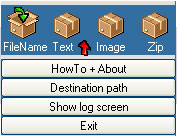



## PSC Downloader 1\.1

### Description

This little App is a enhancement of my former PSC Downloader (http://www.planetsourcecode.com/vb/scripts/ShowCode.asp?txtCodeId=27782&lngWId=1).

What it does:

1) Let you drag and drop code projects from PSC to download sources and info about it.

2) Download sources into a directory of same name as the project (NEW).

3) Download project description.

4) Download project image (Enhanced).

5) Create internet Shortcut in download folder to project homepage at PSC (NEW).

6) Download zip-file.

7) Stays on top.

8) Easily to drag around on the screen.
 
### More Info
 

             |
---                |---
**Submitted On**   |2003-02-25 11:32:44
**By**             |[Thomas Hannibal](https://github.com/Planet-Source-Code/PSCIndex/blob/master/ByAuthor/thomas-hannibal.md)
**Level**          |Intermediate
**User Rating**    |5.0 (35 globes from 7 users)
**Compatibility**  |VB 6\.0
**Category**       |[Complete Applications](https://github.com/Planet-Source-Code/PSCIndex/blob/master/ByCategory/complete-applications__1-27.md)
**World**          |[Visual Basic](https://github.com/Planet-Source-Code/PSCIndex/blob/master/ByWorld/visual-basic.md)
**Archive File**   |[PSC\_Downlo1845961312005\.zip](https://github.com/Planet-Source-Code/thomas-hannibal-psc-downloader-1-1__1-58582/archive/master.zip)

